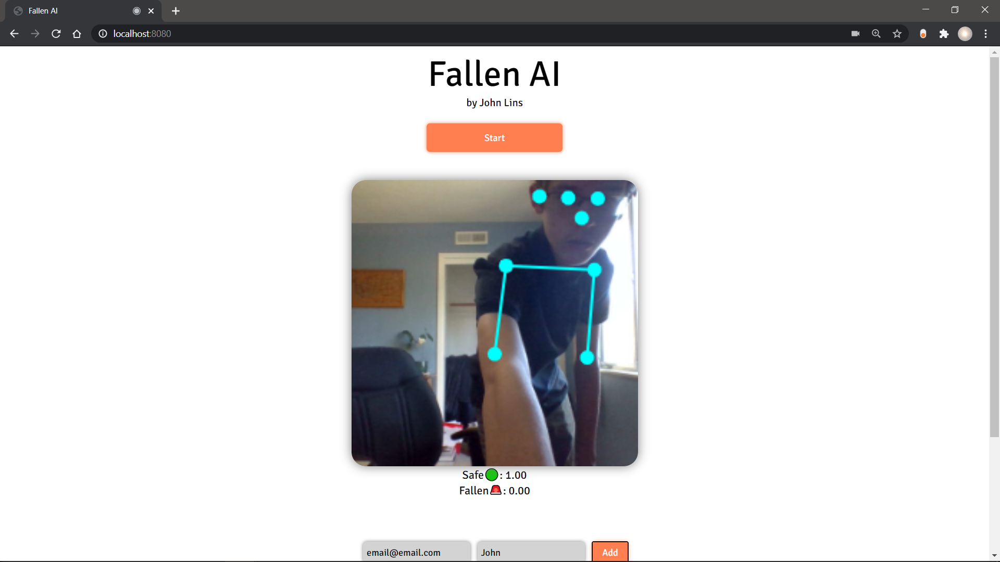

# FallenAI

Got First Place at HackTable (342 Participants) 

Watch announcement here: https://www.youtube.com/watch?v=6jbyE5JK53M&t=705s 

`"The judges looked at many submissions... and they tried to solve very complex problems, but one of the reasons why the judges chose FallenAI is because of the simplicity of the application and how well it was all put together. So essentially, I tried it myself! And there was also a WOW-factor. You just start the application in the web browser, and it immediately recognizes you, and if you make a sudden move to the floor, it notifies that the person has fallen. And you know, just a bit of advice for everyone, by the way, this is advice that I received in the industry and I thought this was one of the best pieces of advice for myself, 'Do not try to boil the ocean' this is a good example where it's a simple problem, very well done. Very easy to receive and understand what is happening here. So congratulations on that!" - Alex Nazarow (HackTable Judge, MS in CS & Applied Mathematics, Principal Software Engineer at AWS)`

View on Devpost: https://devpost.com/software/fallenai 

A pose detection AI built with Tensorflow JS to monitor the old and the weak and send status notifications to their guardians in the case of an emergency.

